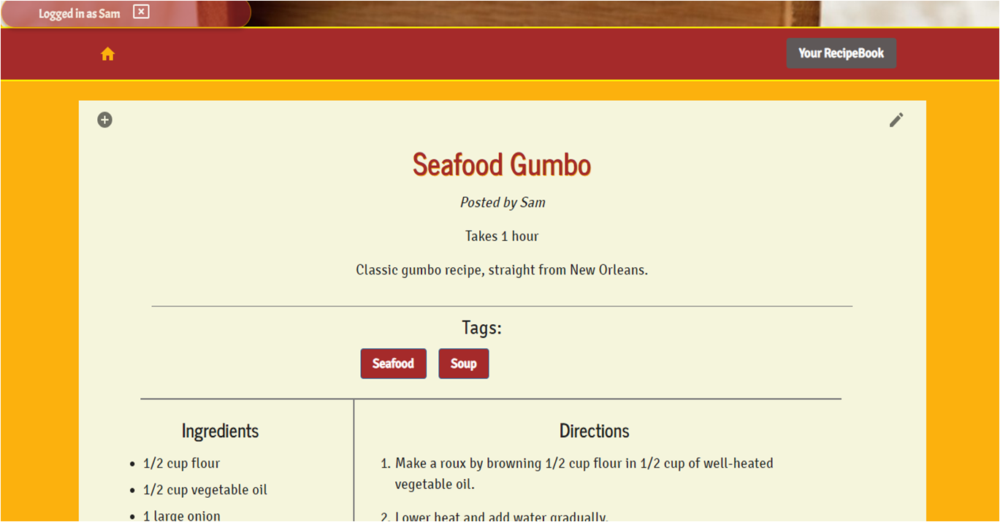

# RecipeBook

## Deployed Project

https://recipebook-online.herokuapp.com/

## Overview

Recipe Book is a full-stack recipe-sharing application for posting recipes publicly or keeping a private collection accessible only to a specific logged-in user. The user interface was built with React.js, and it uses Bootstrap styling, a MongoDB database with Mongoose modeling, an Express server with routing, and some Material-UI components.

The following NPM packages were used in the main folder's package.json:

* axios
* express
* mongoose
* if-env

The following NPM packages were used in the client folder's package.json:

* axios
* chart.js
* cheerio
* react
* react-dom
* react-router-dom
* react-scripts
* @material-ui/core
* @material-ui/icons
(Also present are request and react-tooltip, which were not actually used.)

## What's Different?

Sites like AllRecipes and Yummly may allow users to store their recipes in a private collection, but Recipe Book allows them to edit recipes posted by others and retrieved from other websites. When a user edits another poster's recipe, it creates a separate record, thus making it their own and leaving the original unaffected.

In addition, most sites have proctored content and articles, while Recipe Book's public offerings can be posted by anyone, allowing family favorites to be shared with others.

## User Experience

The website is made up of five main pages:

* home.js, the landing page
* postRecipe.js, the form page for posting and scraping recipes
* recipe.js, the page for viewing (and editing) a specific public recipe
* privateRecipes.js, the Recipe Book displaying all of the current user's private recipes
* privateRecipe.js, the page for viewing (and editing) a specific private recipe

On the home page, a new user has access to recipes posted publicly, including a keyword search. Only five recipes are displayed at a time, with arrow buttons allowing the user to show the next five or the previous five. When a user either signs in as a new user or as a returning user, various elements become visible. The sign-in expansion panel is replaced with an expansion panel with tips for posting, editing, and deleting recipes. Also added are a drawer featuring tags and the user's user name, a button to access the recipe form, and a button to link to the user's personal Recipe Book. The drawer's tags can trigger a recipe search based on tag, and it includes a button to display a pie chart (courtesy of chart.js) showing the percentage of each tag used. If the user originally posted a recipe, a trashcan icon allows them to delete it from the home page, that is change its status from public to private.

On the postRecipe page, the form includes fields for the recipe name, creator name, total cook time, description, and image link. For ingredients and directions, there are also initial fields for Ingredient 1 and Step 1; a button below each causes an additional field to be added below the first (Ingredient 2, Ingredient 3, etc.). A tag dropdown list allows tag buttons to be added in a section above. Near the top, a user can choose from a dropdown of websites (Food Network, AllRecipes, etc.) and enter a corresponding URL; clicking the nearby button will scrape the URL for a recipe and add it to the user's private Recipe Book. (Scraped recipes cannot be made public.)

On the recipe page, a public recipe is displayed with all important information (name, original creator's name, ingredients, a link to the original source if it was scraped from another site, etc.). In the top left corner is an Add button that adds the recipe to the current user's Recipe Book, if the recipe is not already there; either way, it links directly to their Recipe Book page. If the user was the one who originally posted the recipe, an edit icon appears in the top left. Clicking it hides the recipe and shows the edit form, filled out with all of the recipe information, which the user can then update. Submitting the update will update the public recipe and anywhere the recipe has been added to others' Recipe Books.

On the privateRecipes page, all of the user's saved recipes (those they posted/scraped and those they've saved from the public recipes) are displayed as cards showing the recipe name, creator name, cooktime, and image, with a default image if no image link was provided. If the recipe has been edited, the word "Original: " appears before the creator name. Every card has a trash can allowing them to delete the recipe from their Recipe Book. If the recipe is marked as public, it will only remove it from their Recipe Book and not affect the public one on the home page. If the recipe is marked as private (meaning only the user has access to it), the recipe is entirely deleted from the database. Also on this page is the same search field and tag drawer, which now search only the user's saved recipes. There is also another button to show the pie chart, which shows the tag percentages of the user's saved recipes. Clicking the recipe name on the card goes to the privateRecipe page.

On the privateRecipe page, a single private recipe is displayed, along with an edit button in the top right corner, much like the public recipe page. If the recipe is private and not scraped from another site, the user also has the ability to make it public from this form. If the user makes a change on the edit form and submits, two things can happen.
* If the recipe is public (such as one saved from the home page), it creates a separate private record that only the current user has access to.
* If the recipe is private (meaning marked as private, scraped, or already edited), it simply updates the current recipe.

## React Components

* Chart, for the pie chart 
* Collapsible, for the sign-in expansion panel
* Collapsible2, for the notes expansion panel
* DirectionFields, for the directions column of the RecipeForm
* Drawer, for the drawer with logout and tags
* EditDirectionFields, for the edit form's directions column
* Edit IngredientFields, for the edit form's ingredients column
* Grid, for Bootstrap containers, rows, and columns
* Header, for the jumbotron and site title
* IngredientFields, for the ingredients column of the RecipeForm
* Modal, holding the addModal, chartModal, deleteModal,
    signInModal, and logInModal
* Navbar, for the navbar on every page
* PostedRecipes, for the column of public recipes on the home page
* PrivateRecipeSpec, for a single recipe and its edit form on the privateRecipe page
* RecipeBook, for all the cards on the privateRecipes page
* RecipeForm, for the form on the postRecipe page
* SearchField, for the search field in the navbar on the Home and privateRecipes pages
* SignInHome, for the buttons in the Collapsible expansion panel

## Mongoose Models

For recipes, the following schema was used (all Strings unless specified), as well as an index allowing a search of String text:
* name (of the recipe, required)
* creator
* creatorID (the current user's _id)
* description
* ingredients (an object)
* directions (an object)
* cooktime
* tags (an array)
* imgLink
* public (a boolean, default true)
* edited (a boolean, default false)
* deleted (a boolean, default false, become true when a public recipe is made private)
* otherSite (a boolean, default false, becomes true when a recipe is scraped from another site)
* link (to a scraped recipe's original source)
* source (the name of a scraped recipe's source, such as "Epicurious")
* dateSaved (Date, default Date.now, for displaying the most recent public recipes first)

For users, the following schema was used, as well as an index ensuring that user name/password pairs must be unique:
* name (required, not unique)
* password (required, not unique)
* state (required)
* email (required)
* dateSaved (Date, default Date.now)
* recipes (an array storing the ObjectIDs of recipes; these are the recipes displayed in a user's private Recipe Book page)

